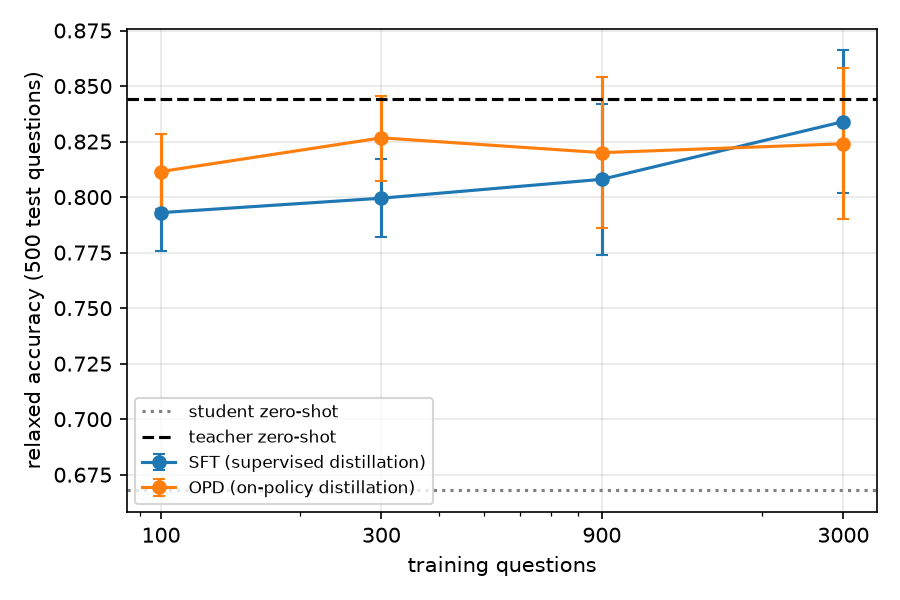
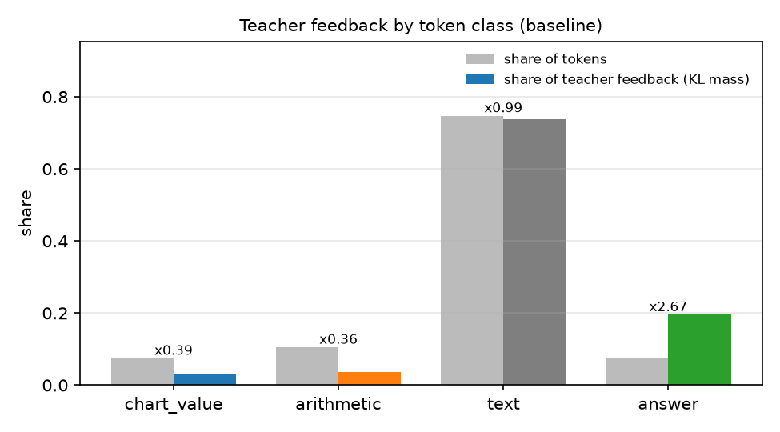
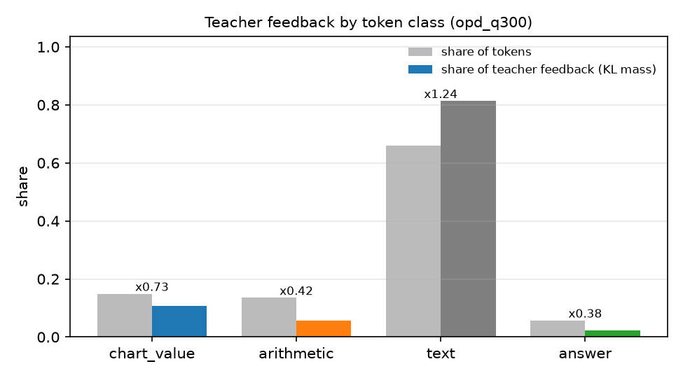

# On-Policy Distillation for Vision-Language Reasoning

[](https://github.com/ffy208/On-Policy-Distillation-for-Vision-Language-Reasoning/actions/workflows/ci.yml)
[](https://ffy208.github.io/On-Policy-Distillation-for-Vision-Language-Reasoning/)
[](LICENSE)

On-policy distillation (OPD) transferred from text-only LLMs to a vision-language model, compared against supervised distillation (SFT) on ChartQA, with a token-level analysis of where the teacher's feedback lands. Project page with figures: https://ffy208.github.io/On-Policy-Distillation-for-Vision-Language-Reasoning/

Student: `Qwen/Qwen3-VL-2B-Instruct` (LoRA rank 64 on the language model, vision tower frozen). Teacher: `Qwen/Qwen3-VL-8B-Instruct`. Task: ChartQA, human-written questions, 3000 train / 500 test, one Colab A100 40 GB.

## Headline results

| Model | Accuracy on 500 held-out questions (95% CI) |
|---|---|
| Student, zero-shot | 0.668 [0.626, 0.710] |
| SFT on 3000 questions (2402 verified teacher solutions, 2 epochs) | 0.834 [0.802, 0.866] |
| OPD on 300 questions (2400 rollouts), mean of 4 seeds | 0.826 [0.810, 0.843] |
| Teacher, zero-shot | 0.844 [0.812, 0.876] |

1. **Is OPD stronger than SFT on multimodal reasoning?** In the low-data regime, yes: over four seeds OPD beats SFT by 1.8 points at 100 training questions and by 2.7 points at 300; paired bootstrap 95% CIs +0.4 to +3.4 and +1.3 to +4.2. At 900 and 3000 questions both methods saturate at the teacher ceiling and the differences are within noise.
2. **Is OPD more data-efficient?** Yes. OPD with 10% of the questions (0.826, 4 seeds) sits within the interval of SFT trained on all of them (0.834), and OPD on 100 questions (0.811, 4 seeds) matches SFT on 900 (0.808), reproducing the data-efficiency claim of Agarwal et al. (2024) in the vision-language setting.
3. **Where does the teacher's token-level feedback land?** Not on chart-reading digits. Before training, the final-answer line receives 2.7x its length share of the teacher's KL; after OPD that drops to 0.4x, mean per-token KL halves, and the residual feedback shifts toward chart values.

All numbers come from the json files in the private Hub repo `ffyang/vlm_opd_results`; the measurable record per stage is in [docs/resume_log.md](docs/resume_log.md).

## Why OPD: from behavior cloning to DAgger to OPD

1. **Supervised distillation is behavior cloning.** Fine-tuning the student on teacher outputs only teaches it on states the teacher visited.
2. **Behavior cloning suffers from compounding errors.** Once the student drifts at inference time it enters states never seen in training, errors accumulate, and regret grows quadratically in the sequence length T, O(T²ε). Long chain-of-thought reasoning has a large T, so the problem is most severe there.
3. **DAgger's fix.** Let the student roll out on its own and query the expert for the correct action on the states the student actually reaches. Regret drops to O(Tε). The cost is online expert queries.
4. **A teacher LLM can be queried online for free.** The student generates a sequence, the teacher provides a distribution over every generated token, and we minimize the per-token KL. This is OPD (Agarwal et al. 2024).
5. **Transfer to VLMs.** OPD only acts on the output distribution over text tokens; the image is just part of the prefix, so the method transfers directly. What changes is engineering, listed in the next section.

## What changes for a VLM

- **Image tokens never enter the loss.** A ChartQA image becomes 300 to 600 visual tokens in the prompt. Both the SFT collator and the OPD trainer mask every prompt and image position; only generated text tokens up to and including `<|im_end|>` are supervised or scored.
- **One image tensor, two models.** The processor runs once per batch; teacher and student receive the identical `pixel_values` and `image_grid_thw` and the identical token sequence. The vision encoder runs once per model, which is unavoidable, but nothing is re-preprocessed.
- **Resolution is the memory knob.** The longer image side is capped at 768 px and the processor's `min_pixels` / `max_pixels` bound image tokens to [300, 600]. With this, teacher 8B + student 2B + LoRA optimizer + activations peak at 27 GB, leaving room on a 40 GB card.
- **Rollout batches are left-padded** so every generation starts at the same index, which lets `logits_to_keep` select the generated span for both models and keeps the two vocabulary-sized logit tensors at about 1.2 GB each instead of materializing logits over image positions.
- **Rollout, not scoring, is the cost.** Per OPD step at batch 16: rollout 15 to 47 s, teacher forward 1 s, student forward-backward 3.5 s. Generation is latency-bound on sequential decoding, so a larger rollout batch is nearly free; batch 16 doubled throughput at the same 27 GB.
- **Merged weights for evaluation.** The LoRA adapter is merged into the base weights and pushed as a standalone model, so vLLM evaluation is the same code path for every model and does not depend on vLLM's LoRA support for Qwen3-VL.
- **Human-written questions only.** On a random ChartQA mix (three quarters machine-generated) the 2B student already scores 0.84 zero-shot against 0.90 for a 4B teacher, too little headroom to separate methods. Human questions give 0.668 vs 0.844.

## Results in detail

### Data-efficiency curve (updated 2026-09-10 with seeds; 500 human-written test questions)



| Training questions | SFT (302 steps) | OPD (150 steps x batch 16) | OPD - SFT, paired 95% CI |
|---|---|---|---|
| 100 (3%) | 0.793 [0.775, 0.810], 4 seeds, sd 0.022 | 0.811 [0.794, 0.829], 4 seeds, sd 0.009 | +0.018 [+0.004, +0.034] over 4 seeds |
| 300 (10%) | 0.799 [0.782, 0.817], 4 seeds, sd 0.015 | 0.826 [0.810, 0.843], 4 seeds, sd 0.007 | +0.027 [+0.013, +0.042] over 4 seeds |
| 900 (30%) | 0.808 [0.774, 0.842], 1 seed | 0.820 [0.786, 0.854], 1 seed | +0.012 [-0.016, +0.040] |
| 3000 (100%) | 0.834 [0.802, 0.866], 1 seed | 0.824 [0.790, 0.858], 1 seed | -0.010 [-0.036, +0.016] |

Intervals are bootstrap over questions pooled across seeds; the paired delta is computed over the seeds both methods share (seed = data order and rollout sampling; the test set is fixed). Per-seed accuracies at 100 questions: SFT 0.816 / 0.778 / 0.808 / 0.770, OPD 0.816 / 0.810 / 0.820 / 0.800; at 300: SFT 0.778 / 0.814 / 0.806 / 0.800, OPD 0.836 / 0.820 / 0.826 / 0.824. The original single-seed run (seed 42, SFT 0.778 vs OPD 0.836, +5.8) was the most favourable draw; the four-seed estimate is smaller but its interval excludes zero at both budgets. OPD's across-seed spread is about half of SFT's.

Update counts are fixed across budgets so data quantity is the only variable: SFT runs 302 optimizer steps everywhere (2 epochs at 3000), OPD runs 150 steps of batch 16 everywhere. Caveats: 900 and 3000 remain single-seed; the 3000-question OPD run covers each question less than once, so it is undertrained relative to SFT's 2 epochs. The 100- and 300-question points were run on Georgia Tech PACE (L40S, 13.5 s per OPD step); the others on Colab (A100).

### Token-level teacher feedback (2026-09-09, 100 test questions, rollouts sampled at temperature 1.0)

| Token class | Zero-shot student: tokens -> KL mass (concentration) | OPD-300 student: concentration |
|---|---|---|
| answer | 7.3% -> 19.5% (2.67x) | 0.38x |
| text | 74.8% -> 73.9% (0.99x) | 1.24x |
| chart_value | 7.4% -> 2.9% (0.39x) | 0.73x |
| arithmetic | 10.5% -> 3.7% (0.36x) | 0.42x |
| mean KL per token | 0.489 | 0.235 |




Concentration is the share of total KL mass divided by the share of tokens. Before training the teacher's feedback concentrates on the final answer and on discourse and format tokens, not on chart-reading digits. Two things explain the low value for digits: both models condition on the same image, and numbers are tokenized digit by digit with the disagreement sitting on the first digit of each number, which per-token averaging dilutes (the heatmaps show this directly). After OPD the answer-line feedback almost vanishes, the student adopts the teacher's `Step N:` format, and the residual feedback shifts toward chart values, i.e. what remains to learn is perception rather than answer selection or format. Token roles are heuristic; the `text` class mixes structural and reasoning tokens.

### Training cost (A100 40 GB)

| Run | Cost |
|---|---|
| Evaluation, 500 questions with vLLM | 12 s (2B), 36 s (8B) plus about 3 min engine start |
| Teacher solution sampling, 3000 questions | a few minutes; 80.1% of solutions verified correct and kept |
| SFT, 302 steps, effective batch 16 | 12 min, 2.3 s/step |
| OPD, 150 steps, batch 16 | about 90 min, 35 s/step, peak 27 GB |

## Method details

### Stage 1: supervised distillation

- The teacher answers each training question once at temperature 0.7; only solutions whose final answer scores correct are kept (`generate_teacher.py`). `--num-samples k` rejection-samples k candidates per question.
- SFT uses the plain transformers `Trainer` with `SFTCollator` rather than TRL's `SFTTrainer`. The collator encodes the prompt (with the image) through the processor and appends the separately tokenized response plus `<|im_end|>`, so labels are exactly -100 on every prompt and image position. TRL's VLM path changes between releases and its dependencies clash with vLLM; peft + accelerate install next to vLLM, so one Colab environment runs generation, training, and evaluation with no restarts.
- LoRA (rank 64, alpha 128) targets only the language-model projections (`q/k/v/o/gate/up/down_proj` under `language_model`): 69.7M trainable parameters, 3.17% of the model. The vision tower and projector stay frozen; `trainable_summary()` asserts this at startup.

### Stage 2: on-policy distillation

- Rollouts are sampled with `do_sample=True`, temperature 1.0, `top_k=0`, `top_p=1.0`, never greedy: the point of on-policy training is covering the states the student actually reaches.
- The loss is the exact full-vocabulary per-token KL, `reverse` = KL(student || teacher) by default (`--kl-direction forward` for the ablation), averaged over generated tokens up to and including the first `<|im_end|>`, computed in fp32 chunks of 64 positions; a batch is processed in micro-batches with gradient accumulation.
- Every step logs per-token KL, mean and max rollout length, EOS rate, `Answer:` format rate, rollout accuracy against gold, time split into rollout / teacher forward / student forward-backward, peak GPU memory, learning rate, and gradient norm to `opd_log.jsonl`.
- Every `ckpt_every` steps the LoRA adapter, optimizer, scheduler, data cursor, and epoch go to the Hub with a `latest.txt` pointer; re-running the notebook resumes from there. Data order is a seeded permutation per epoch and rollout sampling is seeded per step, so a resumed run follows the same trajectory. Verified on a real disconnect: the 300-question run resumed at step 75 and finished.
- Length did not collapse or run away: mean rollout length stayed between 80 and 190 tokens over 150 steps with EOS rate at 1.0.

### Stage 3: data-efficiency curve

- Budgets are the first 300, 900, and 3000 questions of the sampled train set; SFT and OPD see identical questions. For SFT the budget is applied to the kept teacher solutions by question index (`--max-question-index`).
- Each point carries a percentile bootstrap interval; OPD minus SFT at each budget uses a paired bootstrap over questions (`analysis/stats.py`). The notebook is restart-safe: finished points are detected from the Hub results repo and skipped, and interrupted OPD runs resume.

### Stage 4: token-level feedback

- The student samples one solution per test question at temperature 1.0; teacher and student score the identical sequence; per token we record the full-vocabulary reverse KL and the sampled-token log-ratio log p_student - log p_teacher.
- Token roles (`analysis/token_classes.py`): the final `Answer:` line is `answer`; digit and operator tokens on lines with an arithmetic cue are `arithmetic`; digit tokens on other lines are `chart_value`; everything else is `text`. A digit-position breakdown compares the first token of each number with its later tokens.

## Reproducing

### On a Slurm cluster

See [docs/pace.md](docs/pace.md): `slurm/setup_env.sh` once, then one job per point via `slurm/point.sbatch` or a grid via `slurm/sweep.sh`. The OPD trainer now also logs, every step, the share of teacher KL by token role (answer / arithmetic / chart_value / text), so every run produces the feedback-dynamics data for free.

### Colab notebooks

Open from GitHub (Colab keeps its own copy, so reopen after every push that touches a notebook). Each notebook is generated from `notebooks/build_*.py`; edit the script, not the JSON.

- Stage 0, data and baselines: https://colab.research.google.com/github/ffy208/On-Policy-Distillation-for-Vision-Language-Reasoning/blob/main/notebooks/00_setup_and_eval.ipynb
- Stage 1, SFT: https://colab.research.google.com/github/ffy208/On-Policy-Distillation-for-Vision-Language-Reasoning/blob/main/notebooks/01_sft.ipynb
- Stage 2, OPD: https://colab.research.google.com/github/ffy208/On-Policy-Distillation-for-Vision-Language-Reasoning/blob/main/notebooks/02_opd.ipynb
- Stage 3, data efficiency: https://colab.research.google.com/github/ffy208/On-Policy-Distillation-for-Vision-Language-Reasoning/blob/main/notebooks/03_data_efficiency.ipynb
- Stage 4, token feedback: https://colab.research.google.com/github/ffy208/On-Policy-Distillation-for-Vision-Language-Reasoning/blob/main/notebooks/04_token_feedback.ipynb

Every notebook needs an A100 40 GB (the 8B teacher does not fit a 15 GB T4) and `HF_TOKEN` in Colab Secrets.

### Fixed conventions

| Item | Value |
|------|-------|
| Random seed | 42, passed explicitly to sampling, generation, and training |
| Data | ChartQA (`HuggingFaceM4/ChartQA`), human-written questions only, 3000 sampled from train and 500 from test; unified schema `{id, image, question, answer}` on the Hub |
| Images | longer side ≤ 768 px; processor `min_pixels` / `max_pixels` keep image tokens between 300 and 600 |
| Prompt | `PROMPT_TEMPLATE` in `vlm_opd/common.py`: reason first, last line `Answer: xxx`; identical for every model and stage |
| Scoring | relaxed accuracy: numeric answers within 5% relative error; text answers exact after normalization; a missing `Answer:` line counts as wrong |
| Evaluation decoding | greedy, `max_new_tokens=512`, vLLM |
| SFT | lr 1e-4, cosine, effective batch 16, 302 steps, LoRA r64 |
| OPD | lr 5e-5, cosine, batch 16, micro-batch 4, 150 steps, reverse KL, temperature 1.0, checkpoint every 25 steps |

All hyperparameters are in `configs/*.yaml`.

### Storage

Model weights are downloaded to local disk each session (`HF_HOME=/content/hf_cache`), never to Drive. The sampled dataset, the verified teacher solutions, every LoRA checkpoint (adapter + optimizer + `latest.txt`), every merged model, and every result json live in private Hub repos under `ffyang/vlm_opd_*`. The HF token is read from Colab Secrets through `common.get_hf_token()` and never written to disk.

### Local development

```bash
uv venv && source .venv/bin/activate
uv pip install -e ".[dev]"
uv pip install torch torchvision --index-url https://download.pytorch.org/whl/cpu
uv pip install transformers peft   # for the collator, LoRA, and OPD tests on a tiny Qwen3-VL
pytest
```

The test suite runs on CPU: answer parsing and scoring, deterministic sampling, checkpoint save/restore, prompt masking with the real Qwen3-VL processor, LoRA targeting, a forward/backward pass and a full OPD step on a tiny randomly initialised Qwen3-VL, bootstrap statistics, and the analysis renderers.

## Repository layout

```
vlm_opd/
  common.py         prompt styles (chart, geometry), Answer: parsing incl. sqrt/frac/pi expressions, relaxed accuracy, data loading
  hub_utils.py      checkpoint push to the HF Hub and resume after disconnect
  prepare.py        source adapters (ChartQA, Geometry3K, CharXiv, ChartQAPro), seeded sampling, image resizing, Hub push
  evaluate.py       vLLM batch inference + scoring -> json
  generate_teacher.py sample teacher solutions with vLLM, keep the correct ones, push as SFT data
  collate.py        prompt encoding and supervised batches with prompt/image positions masked
  modeling.py       student loader: frozen base + vision, LoRA on language-model projections only
  sft.py            LoRA SFT with the transformers Trainer, merge + push to Hub
  opd_utils.py      rollout inputs, generation masks, per-token KL, vision-batch slicing (pure tensors)
  opd_trainer.py    on-policy distillation loop: rollout -> teacher/student scoring -> KL -> LoRA update
  analysis/stats.py            bootstrap intervals and paired bootstrap deltas
  analysis/data_efficiency.py  accuracy-vs-questions table, crossover point, figure, report
  analysis/ood.py              out-of-distribution table per held-out set (zero-shot rows, SFT/OPD per budget, paired delta)
  analysis/token_feedback.py   student rollouts scored by both models: per-token reverse KL and log-ratio
  analysis/token_classes.py    token roles, per-class aggregation, digit-position statistics
  analysis/heatmap.py          token heatmap and per-class bar chart rendering
  experiment.py     one (task, method, budget, seed) point end to end, idempotent against the Hub results repo
notebooks/          00 to 04 (Colab drivers) and the build_*.py scripts that generate them
slurm/              PACE / Slurm setup, single-point job, and sweep scripts (see docs/pace.md)
configs/            yaml configs per stage
docs/resume_log.md  measurable results per stage in XYZ form
docs/research_plan.md paper direction, collision check, experiment plan
docs/pace.md        running the sweep on a Slurm cluster
tests/              offline unit tests
```

## Colab environment notes

Three preinstalled-package conflicts and one API change were needed to run vLLM and peft in one Colab runtime; all are handled by the notebooks.

- Installing vLLM upgrades torch to a newer CUDA build while the preinstalled torchaudio stays on the old one, and transformers then fails to import any processor (`PyTorch and TorchAudio were compiled with different CUDA versions`). The install cell uninstalls torchaudio.
- The Pillow directory can end up with a mix of Pillow 11 and 12 files (`ImportError: cannot import name '_Ink' from 'PIL._typing'`). Each notebook has an idempotent repair cell that checks Pillow in a subprocess, and if broken deletes the `PIL` directory, installs Pillow 12 with `PIP_CONSTRAINT` unset, and restarts the runtime once, because the Colab kernel imports PIL at startup and keeps the old modules in memory.
- peft rejects Colab's preinstalled torchao 0.10 when injecting LoRA (`only versions above 0.16.0 are supported`). We never quantize, so the install cell uninstalls torchao.
- transformers 5 removed `warmup_ratio` from `TrainingArguments`; `sft.build_training_args` passes the ratio through `warmup_steps` on that API.

Verified assumptions (2026-09-07): `HuggingFaceM4/ChartQA` has fields `image / query / label(list[str]) / human_or_machine` with 28299 train and 2500 test rows. The Qwen3-VL processor uses patch 16 and merge 2, so one visual token covers 32x32 pixels, and both transformers and vLLM accept `min_pixels` / `max_pixels`.

## Related work (2026)

OPD for LLMs: MiniLLM and GKD (Agarwal et al., 2024); Thinking Machines' 2025 write-up; [Rethinking OPD](https://arxiv.org/html/2604.13016v1) frames it as dense KL-constrained RL. OPD for VLMs became an active thread in 2026: [VOLD](https://arxiv.org/abs/2510.23497), [Visual-Advantage OPD](https://arxiv.org/abs/2605.21924), [Decomposed OPD / Visual Gradient Steering](https://arxiv.org/abs/2606.00564), [Fisher-Projected OPD](https://arxiv.org/abs/2608.01263), [H-OPD](https://arxiv.org/pdf/2607.02592), and [PTD-PO](https://arxiv.org/html/2606.07000v1). This repository is a small, fully reproducible replication; its Stage 4 measurement (vanilla OPD's feedback concentrates on the answer line and format, with chart-value tokens at 0.39x) independently corroborates the premise of the re-weighting papers. [Near-Policy Distillation](https://arxiv.org/pdf/2605.05940) targets the rollout bottleneck measured here.

## Citation

```bibtex
@misc{yang2026vlmopd,
  author = {Frank Yang},
  title  = {On-Policy Distillation for Vision-Language Reasoning},
  year   = {2026},
  url    = {https://github.com/ffy208/On-Policy-Distillation-for-Vision-Language-Reasoning}
}
```

## Status and possible follow-ups

- [x] Stage 0: data, evaluation, baselines (zero-shot 0.668, teacher 0.844)
- [x] Stage 1: SFT baseline 0.834
- [x] Stage 2: OPD trainer with Hub checkpoints and verified resume
- [x] Stage 3: data-efficiency curve; OPD at 10% data matches full-data SFT
- [x] Stage 4: token-level feedback before and after OPD
- [x] 100-question point and 4 seeds at 100 and 300 (PACE, 2026-09-10): OPD's advantage holds at +1.8 and +2.7 points with intervals excluding zero
- [ ] Optional: forward-KL ablation; longer OPD run at 3000 questions; seeds at 900 and 3000; Geometry3K curve; OOD evaluation on CharXiv and ChartQAPro; self-distillation conditions
